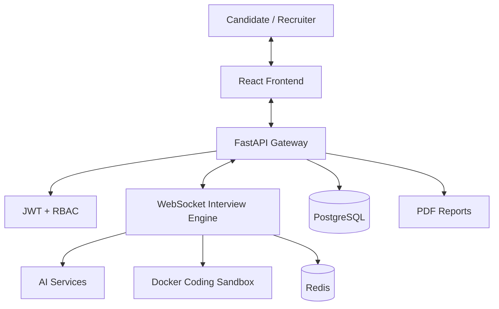

# AI Interview Platform — Project Overview

## 1. Problem

Technical interview preparation and screening often require separate tools for coding, communication, evaluation, and recruiter review. This project combines these workflows into a single platform.

## 2. Solution

The platform provides AI-assisted interviews with real-time interaction, voice support, coding challenges, automated evaluation, and recruiter-facing assessment workflows.

## 3. Core Capabilities

- Adaptive AI technical interviews
- Real-time WebSocket interview sessions
- Voice input/output through speech services
- AI-assisted response evaluation
- Isolated coding execution with Docker
- Candidate and recruiter workflows
- JWT authentication and RBAC
- Redis caching/session support
- PostgreSQL persistence
- PDF assessment reports

## 4. Architecture



## 5. Engineering Focus

The project was designed to explore asynchronous backend development, stateful real-time communication, AI integration, secure code execution, caching, authentication/authorization, automated testing, and containerized deployment.

## 6. Technology Stack

- **Frontend:** React, Vite, Tailwind CSS
- **Backend:** Python, FastAPI
- **Database:** PostgreSQL, SQLAlchemy
- **Real-time:** WebSockets
- **AI:** OpenAI services, TTS, Whisper
- **Cache:** Redis
- **Execution:** Docker / Docker Compose
- **Security:** JWT, Bcrypt, RBAC
- **Reports:** ReportLab
- **Testing:** Pytest
- **CI/CD:** GitHub Actions

## 7. Development Workflow

```text
Feature → Implementation → Test → CI Check → Review → Integration
```

## 8. Future Work

- Expand interview analytics
- Improve adaptive difficulty and scoring rubrics
- Add additional programming languages
- Strengthen sandbox isolation and resource limits
- Add production observability and metrics
