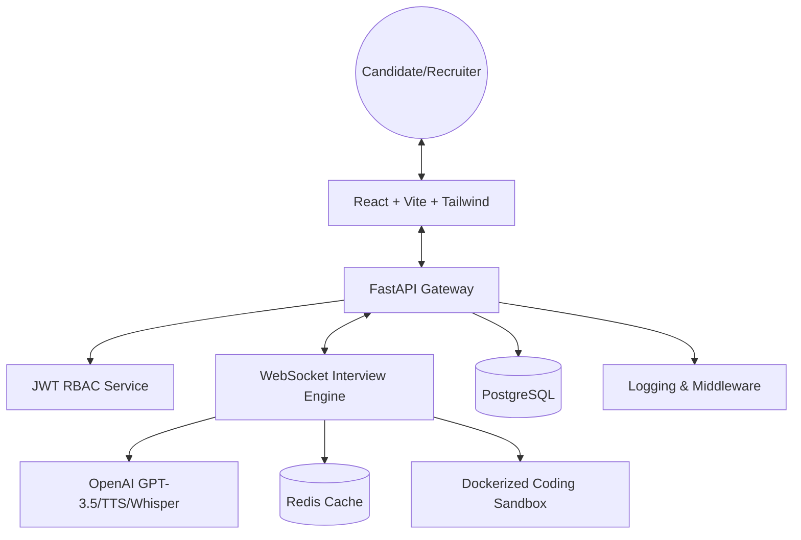

# AI Interview Platform - Engineering Documentation

A high-fidelity AI-as-a-Service platform for automated technical interviews, featuring real-time evaluation, safe code sandboxing, and multi-tenant recruiter portals.

---

## 🏗️ Architecture Overview



---

## 🔄 Key Workflows

### 1. The Interview Loop
1.  **Initialization**: User uploads resume -> AI extracts skills -> Recruiter selects Job Role.
2.  **Engagement**: WebSocket connection starts -> AI generates adaptive questions -> TTS converts to audio.
3.  **Evaluation**: Candidate answers (Text/Voice) -> Whisper STT converts voice to text -> AI scores technical correctness.
4.  **Sandbox**: Coding challenges launch ephemeral Docker containers -> Sandbox executes code -> Results returned to AI for scoring.

### 2. Recruiter Pipeline
1.  **Job Creation**: Recruiter defines Job Roles & AI Benchmarks.
2.  **Review**: Dashboard aggregates candidate scores & anti-cheating signals.
3.  **Export**: Formal PDF reports generated via `ReportLab` with deep AI analytics.

---

## 🛠️ Technical Stack & Engineering Depth

| Layer | Technology | Engineering Highlights |
| :--- | :--- | :--- |
| **Backend** | Python 3.11, FastAPI | Asynchronous IO, Dependency Injection, SQLAlchemy ORM |
| **Real-time** | WebSockets | Stateful session management, recovery logic |
| **AI/ML** | OpenAI API | Prompt compression, semantic caching, adaptive difficulty |
| **Infrastructure** | Docker, Docker Compose | Microservices isolation, secure sandboxing (DIND) |
| **Persistence** | PostgreSQL, Redis | Relational data integrity + high-speed caching |
| **Security** | JWT, Bcrypt | RBAC (Admin/Recruiter/Candidate) |

---

## 🚀 Setup & Installation (Docker Standard)

### Prerequisites
- Docker & Docker Compose
- OpenAI API Key

### 1-Step Quickstart
```bash
docker-compose up --build
```
The platform will be available at:
- **Frontend**: `http://localhost:3000`
- **Backend API**: `http://localhost:8000`
- **API Docs**: `http://localhost:8000/docs`

### Seed Accounts
- **Admin**: `admin@ai-platform.com` / `admin123`
- **Recruiter**: `recruiter@hiring.com` / `recruiter123`

---

## 📈 Monitoring & Quality Assurance
- **Logs**: Located in `backend/logs/app.log` (Rotating handler).
- **CI/CD**: GitHub Actions pipeline for automated Pytest and Build checks.
- **Testing**: Run local tests via `cd backend && python -m pytest`.
