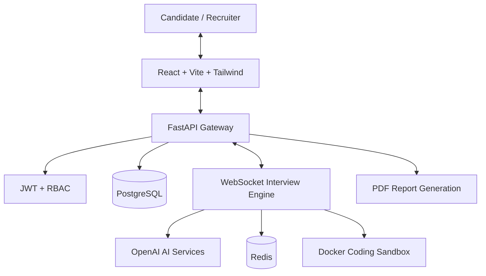

# AI Interview Platform

> AI-powered technical interview platform for candidates and recruiters, with real-time interviews, adaptive evaluation, coding challenges, and recruiter analytics.

## Why this project?

Traditional interview practice usually separates coding, communication, and evaluation into different tools. This platform brings them into one workflow: candidates can complete AI-driven interviews while recruiters can create roles, review candidate performance, and export assessment reports.

## Highlights

- **AI-driven interviews** — generates adaptive technical questions based on the candidate and selected role.
- **Real-time interview engine** — WebSocket-based sessions for interactive interviews.
- **Voice interviews** — text-to-speech for questions and speech-to-text for candidate responses.
- **AI evaluation** — analyzes responses for technical correctness and produces scores.
- **Coding sandbox** — runs coding challenges inside isolated Docker containers.
- **Recruiter portal** — create job roles, define benchmarks, review candidates, and inspect assessment results.
- **Role-based access control** — separate Admin, Recruiter, and Candidate permissions.
- **Candidate anti-cheating signals** — recruiter dashboards can surface interview integrity signals.
- **Automated reports** — generates PDF assessment reports with AI analytics.
- **Caching & session support** — Redis is used for high-speed caching and interview-session support.
- **Testing & CI** — Pytest-based backend tests and GitHub Actions build/test checks.

## System Architecture


```mermaid
graph TD
    Candidate[Candidate / Recruiter] <--> Frontend[React + Vite + Tailwind]
    Frontend <--> API[FastAPI Gateway]
    API --> Auth[JWT + RBAC]
    API --> DB[(PostgreSQL)]
    API <--> WS[WebSocket Interview Engine]
    WS --> AI[OpenAI AI Services]
    WS --> Redis[(Redis)]
    WS --> Sandbox[Docker Coding Sandbox]
    API --> Reports[PDF Report Generation]
```

## Interview Workflow

```text
Resume / Candidate Profile
          ↓
      Skill Extraction
          ↓
      Role Selection
          ↓
  Real-time AI Interview
          ↓
 Text / Voice Responses
          ↓
 AI Evaluation + Scoring
          ↓
 Candidate Assessment
          ↓
 Recruiter Dashboard + PDF Report
```

## Recruiter Workflow

1. Create a job role and define interview benchmarks.
2. Review candidate assessments.
3. Inspect scores and interview integrity signals.
4. Compare candidate performance.
5. Export a detailed PDF assessment report.

## Engineering Stack

| Layer | Technology |
|---|---|
| Frontend | React, Vite, Tailwind CSS |
| Backend | Python, FastAPI |
| Real-time | WebSockets |
| AI | OpenAI API, TTS, Whisper |
| Database | PostgreSQL, SQLAlchemy |
| Cache | Redis |
| Sandbox | Docker / Docker Compose |
| Authentication | JWT, Bcrypt, RBAC |
| Reports | ReportLab |
| Testing | Pytest |
| CI/CD | GitHub Actions |

## Repository Structure

```text
ai-interview/
├── backend/              # FastAPI services, interview engine and business logic
├── frontend/             # React client
├── .github/              # CI/CD workflows
├── docker-compose.yml    # Local multi-service environment
├── run_migrations.py     # Database migration helper
├── deploy-gcp.ps1        # GCP deployment helper
└── PRESENTATION.md       # Project presentation material
```

## Running Locally

### Prerequisites

- Docker
- Docker Compose
- OpenAI API key

### Start the platform

```bash
docker compose up --build
```

Services are configured for:

- Frontend: `http://localhost:3000`
- Backend API: `http://localhost:8000`
- API documentation: `http://localhost:8000/docs`

> Configure secrets through environment variables. Do not commit API keys, passwords, or other credentials to the repository.

### Run backend tests

```bash
cd backend
python -m pytest
```

## Security Considerations

The platform includes several security-oriented design choices:

- JWT authentication and role-based authorization.
- Password hashing with Bcrypt.
- Isolated Docker execution for coding submissions.
- Backend-only handling of AI credentials.
- Redis-backed session/cache support.
- Logging and middleware for monitoring requests.

Production deployments should additionally use restricted container permissions, resource limits, network isolation, secret management, and a dedicated sandbox execution policy.

## What I Learned

This project focuses on engineering problems beyond a basic CRUD application:

- Designing asynchronous APIs with FastAPI.
- Managing stateful real-time WebSocket sessions.
- Integrating AI services into an application workflow.
- Safely executing untrusted code in isolated containers.
- Combining PostgreSQL persistence with Redis caching.
- Implementing RBAC for multiple user types.
- Building automated testing and CI checks.

## Future Improvements

- Add more AI evaluation metrics and customizable scoring rubrics.
- Improve interview analytics and candidate comparison.
- Expand language support in the coding sandbox.
- Add stronger production-grade sandbox isolation and resource quotas.
- Add observability dashboards for latency, failures, and interview sessions.

## Author

**Salavath Haricharan**

Computer Science Engineering student focused on full-stack development, AI applications, and software engineering.
